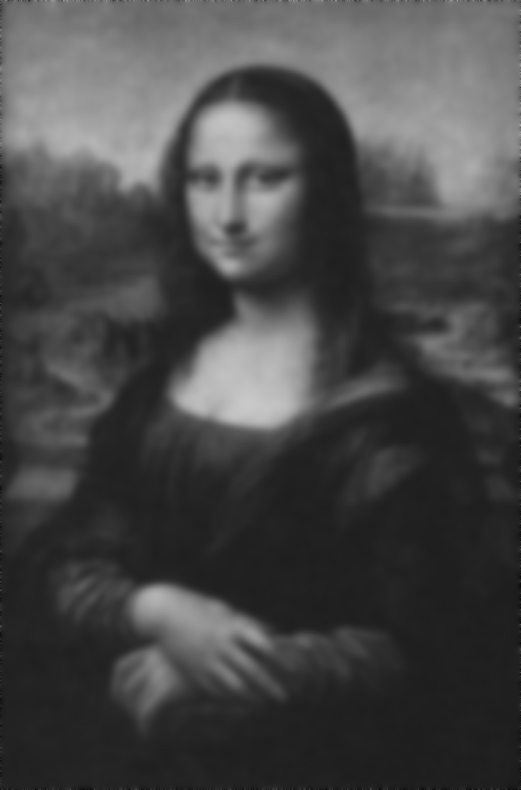

# Project 2
### Denoising image using MPI

This folder contains two folders, one for serial implementation, and one for parallel implementation. To run the code for a given implementation, move into the folder and simply write "make". This will compile the neccesary support files for the main function, and if simple jpeg is not compile, will also compile those files. To clean up the folder, simply write "make clean".  
 
Below are the result of the parallel denoising, first the noisy image to the left, and then denoising with iterations equal to 10, 100 and 1000.

